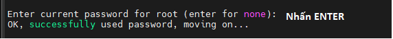

# HƯỚNG DẪN TRIỂN KHAI LEMP ( LINUX + nginx-Ex + MARIADB + PHPmyAdmin) KẾT HỢP WORDPRESS TRÊN UBUNTU 22.04

## I. **CHUẨN BỊ CƠ BẢN**

Sau khi đăng nhập, Quý khách tiến hành thay đổi đường dẫn Repository cho VPS Ubuntu của chúng ta, nhằm tăng tốc độ tải và cài đặt các gói phần mềm cần thiết. Đầu tiên là lệnh lấy các đường dẫn khả dụng gần chúng ta nhất:

```
wget -qO - mirrors.ubuntu.com/mirrors.txt
```


Quý khách chọn một trong những đường dẫn trên để có thể nhập vào file cấu hình, ví dụ ở đây Quý khách chọn đường link của viettelcloud. Sau đó truy cập file Repository bằng lệnh:

```
sudo nano /etc/apt/sources.list
```

Thay đổi tất cả những đường link ban đầu thành đường link mà Quý khách đã lựa chọn, sau đó nhấn tổ hợp phím Crtl + X để lưu và thoát


Sau đó quý khách tiến hành chạy lệnh update để cập nhật Repository cho hệ thống

sudo apt update

## II. **TRIỂN KHAI LEMP**

Do Ubuntu là một hệ điều hành linux nên Quý khách sẽ chuyển sang 3 thành phần còn lại.

### 1. **Nginx-E**

NGINX, đọc là “engine-ex,” là một phần mềm web server mã nguồn mở nỗi tiếng. Ban đầu nó dùng để phục vụ web HTTP. Tuy nhiên, ngày nay nó cũng được dùng làm reverse proxy, HTTP load balancer và email proxy như IMAP, POP3, và SMTP.

Quý khách tiến hành cài đặt Nginx-E

```
sudo apt install  nginx -y
```

Sau đó cho bật Nginx-E và cho phép tiến trình khởi động cùng hệ thống

```
systemctl enable nginx && systemctl start nginx
```


Quý khách cũng có thể xem trạng thái của Nginx-E bằng lệnh:

```
systemctl status nginx
```


#### 2. **MariaDB**

MariaDB là một sản phẩm mã nguồn mở tách ra từ mã mở do cộng đồng phát triển của hệ quản trị cơ sở dữ liệu quan hệ MySQL nhằm theo hướng không phải trả phí với GNU GPL. MariaDB được phát triển từ sự dẫn dắt của những nhà phát triển ban đầu của MySQL, do lo ngại khi MySQL bị Oracle Corporation mua lại.

Quý khách tiến hành cài đặt MariaDB bằng lệnh

```
sudo apt install mariadb-server -y
```

Sau đó cho bật MariaDB và cho phép tiến trình khởi động cùng hệ thống

```
systemctl enable mariadb && systemctl start mariadb
```

Quý khách cũng có thể xem trạng thái của MariaDB bằng lệnh:

```
systemctl status mariadb
```


Tiếp theo Quý khách cần cấu hình cho MariaDB bằng lệnh

```
mysql_secure_installation
```




Bước này rất quan trọng, Quý khách hãy nhớ password này


Tới đây là Quý khách đã cấu hình thành công MariaDB


### 3. **PHP**

Ngôn ngữ PHP là từ viết tắt của Personal Home Page (hiện nay là Hypertext Preprocessor). Thuật ngữ này chỉ chuỗi ngôn ngữ kịch bản hay mã lệnh, phù hợp để phát triển cho các ứng dụng nằm trên máy chủ. Khi viết phần mềm bằng ngôn ngữ PHP, chuỗi lệnh sẽ được xử lý trên server để từ đó sinh ra mã HTML trên client. Và dựa vào đó, các ứng dụng trên website của bạn sẽ hoạt động một cách dễ dàng.

Quý khách tiến hành add thêm Repository PHP để có thể lựa chọn các phiên bản PHP theo nhu cầu:

```
sudo add-apt-repository ppa:ondrej/php -y && sudo apt update
```


Sau đó Quý khách tiến hành cài đặt PHP vào máy, ví dụ Quý khách chọn phiên bản 8.3

```
sudo apt install php8.3 -y
```

Kiểm tra phiên bản PHP đã được cài đặt


## III. **CÀI ĐẶT VÀ CẤU HÌNH WORDPRESS**
### 1. **Cấu hình Database** 

Quý khách sử dụng lệnh để truy cập vào MariaDB và nhập mật khẩu đã cấu hình:

```
mysql -u root -p
```


Sau đó tạo Database cho Wordpress:

```
CREATE DATABASE wordpress DEFAULT CHARACTER SET utf8 COLLATE utf8\_unicode\_ci;
```


Tiếp theo, Quý khách cần tạo một tài khoản gồm username và password, sau đó cấp quyền truy cập Database cho nó:

```
CREATE USER 'wp'@'localhost' IDENTIFIED BY 'P@ssword!';
```


```
GRANT ALL ON wordpress.\* TO 'wp'@'localhost';
```


Quý khách thoát khỏi MariaDB sau khi hoàn thành cấu hình

```
EXIT;
```


### 2. **Cài đặt Wordpress**

Đầu tiên, Quý khách cài đặt Wordpress bằng lệnh sau:

```
wget https://wordpress.org/latest.tar.gz
```

Tiếp theo, Quý khách tiến hành giải nén và phân quyền cho thư mục cài đặt Wordpress:

```
tar zxvf latest.tar.gz -C /var/www/

chown -R www-data. /var/www/wordpress
```

Quý khách xóa file default của nginx:

```
sudo rm /etc/nginx/sites-available/default
```

Sau đó, tạo file default bằng lệnh :

```
sudo nano /etc/nginx/sites-available/default
```

Quý khách nhập các thông số sau đây và save file:
```
server { 

  listen 80; 

  listen [::]:80; 

  server\_name abc.com; 

  root /var/www/wordpress; 

  index index.html index.php; 

    location - \.php$ { 

    include snippets/fastcgi-php.conf; 

    fastcgi\_pass unix:/run/php/php8.3-fpm.sock; 

  }

}
```


Khởi động lại dịch vụ nginx:

```
systemctl restart nginx
```

### 3. **Sử dụng Wordpress**
#### a. **Kết nối Database**

Sau khi hoàn tất quá trình cài đặt, Quý khách đã có thể sử dụng Wordpress bằng cách truy cập bằng địa chỉ IP của VPS. Chọn ngôn ngữ:


Tiếp theo, Quý khách cần nhập database và tài khoản user name đã tạo ở phần [1]


#### b. **Tạo Site**

Quý khách nhập thông tin cho website của mình:


Lúc này quý khách đã có thể truy cập website của mình:


Nếu quý khách muốn chỉnh sửa trang web của mình, thêm wp-login.php vào thanh địa chỉ:


## IV. **Thêm https , trỏ domain về trang web**
### 1. **Trỏ domain về trang web**

Để trỏ tên miền về WordPress, Quý khách cần phải có thông tin về tên miền. Nếu Quý khách chưa có tên miền hãy liên hệ ngay với vinahost.vn để được tư vấn đăng ký. Sau đó, toàn bộ thông tin về tên miền sẽ được gửi cho Quý khách.

Quý khách truy cập trang quản lý tên miền và nhập bản ghi A, trỏ tên miền về địa chỉ IP của VPS:


Sau khi save Record DNS, Quý khách kiểm tra kết quả


### 2. **Https**

HTTPS (Hypertext Transfer Protocol Secure) là giao thức truyền tải siêu văn bản an toàn. Thực chất, đây chính là giao thức HTTP nhưng tích hợp thêm Chứng chỉ bảo mật SSL nhằm mã hóa các thông điệp giao tiếp để tăng tính bảo mật. Có thể hiểu, HTTPS là phiên bản HTTP an toàn, bảo mật hơn.

Quý khách tiến hành cài đặt dịch vụ Let’s Encrypt

```
sudo snap install core; sudo snap refresh core 

sudo snap install –classic certbot -y && sudo ln -s /snap/bin/certbot /usr/bin/certbot
```
Tiếp theo, Quý khách bổ sung subdomain www vào tên miền ở phần cài đặt Wordpress

```
sudo nano /etc/nginx/sites-available/default
```


Sau đó lưu file và khởi động lại nginx

```
sudo systemctl reload nginx
```

Quý khách tiến hành cấu hình chứng chỉ cho trang web của mình

```
sudo certbot --nginx -d ten\_mien.com -d www.ten\_mien.com
```


Sau khi nhập thông tin cho trang web, certbot sẽ hiện kết quả:


Quý khách lúc này đã có thể truy cập vào <https://ten_mien_cua_quy_khach.com> để kiểm tra. Kết quả kiểm tra chứng chỉ SSL trên SSL Labs


*Chúc Quý khách cấu hình thành công!*
